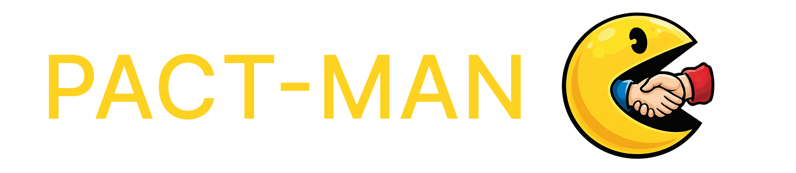

<p align="center">
  
</p>

## Play Now

**[pact-man-kood.vercel.app](https://pact-man-kood.vercel.app/)**

## What is Pact-Man?

Pact-Man is an AI-powered negotiation game. You play as a **Startup Founder** seeking Series A funding, while an **AI VC investor agent** (powered by GPT 5.4 via OpenRouter) negotiates back. Both sides are trying to maximize their score across 5 deal terms — but your score sheets are different, so you'll need to figure out where to push and where to concede.

The investment amount is fixed at **$100M** — what you're negotiating is everything else.

## Run Locally

```bash
npm run dev
```

Starts at `http://localhost:3000`.

## Scoring

Each term has discrete options worth different points to each side. Both parties have a **BATNA (walk-away threshold) of 30 points** — if your final score is below that, you're better off with no deal.

Some options are **No Deal** for one side, meaning the other party will never accept them.

### Founder Score Sheet

| Term | Options | Points |
| :--- | :--- | :--- |
| **#1: VC Equity Percentage** | 60% or more: | **No Deal** |
| | 56% to 59%: | 4 |
| | 50% to 55%: | 8 |
| | 47% to 49%: | 16 |
| | 42% to 46%: | 18 |
| | 36% to 41%: | 20 |
| | 31% to 35%: | 22 |
| | 30% or less: | 24 |
| **#2: Type of Stock** | Redeemable Preferred: | 2 |
| | Convertible Preferred: | 5 |
| | Common: | 6 |
| **#3: VC Appointed Board Members** | More than 2 members: | **No Deal** |
| | 2 members: | 6 |
| | 1 member: | 8 |
| | 0 members: | 2 |
| **#4: Vesting of Founder's Shares** | 6 or more years: | 3 |
| | 4 or 5 years: | 8 |
| | 3 or less years: | 10 |
| | No vesting: | 12 |
| **#5: CEO Replacement Provision** | Aggressive Projections: | **No Deal** |
| | Moderate Projections: | 7 |
| | Conservative Projections: | 14 |
| | No provision: | 19 |

### VC Score Sheet

The AI VC has its own secret scoring — the points are different from yours, which is what makes the negotiation interesting. Revealed here for reference.

<details>
<summary><b>View VC score sheet</b></summary>

| Term | Options | Points |
| :--- | :--- | :--- |
| **#1: VC Equity Percentage** | 25% or less: | **No Deal** |
| | 26% to 34%: | 2 |
| | 35% to 39%: | 3 |
| | 40% to 45%: | 6 |
| | 46% to 49%: | 9 |
| | 50%: | 11 |
| | 51% to 59%: | 15 |
| | 60% to 69%: | 18 |
| | 70% or more: | 20 |
| **#2: Type of Stock** | Common: | 0 |
| | Convertible Preferred: | 8 |
| | Redeemable Preferred: | 12 |
| **#3: VC Appointed Board Members** | 0 members: | 0 |
| | 1 member: | 3 |
| | 2 members: | 5 |
| | 3 members: | 7 |
| | More than 3 members: | 10 |
| **#4: Vesting of Founder's Shares** | Less than 4 years: | **No Deal** |
| | 4 years: | 8 |
| | 5 years: | 12 |
| | More than 5 years: | 14 |
| **#5: CEO Replacement Provision** | No provision: | **No Deal** |
| | Conservative Projections: | 6 |
| | Moderate Projections: | 10 |
| | Aggressive Projections: | 16 |

</details>

## VC Negotiation Styles

Before starting, you choose how the AI VC negotiates:

- **Collaborative** — Partnership-oriented. Explores tradeoffs, suggests package deals, makes first concessions to build goodwill. Frames everything as joint problem-solving.
- **Aggressive** — Tough and demanding. Anchors with aggressive terms, makes small reluctant concessions, uses leverage like deal flow and market risk. Holds firm under pushback.
- **Charming** — Charismatic dealmaker. Uses humor, portfolio stories, and rapport to influence. Makes concessions feel like personal gestures and deflects tough demands with warmth before countering.

## The AI Judge

After every message exchange, a separate **AI judge** (GPT 5.4, using tool calls) reads the full conversation and extracts the current state of each term — what each side has proposed, and whether there's a tentative agreement. This keeps the Deal Tracker sidebar in sync with the conversation without relying on the VC agent to self-report accurately.

## Stack

- **Frontend:** Plain HTML/CSS/JS — no framework, no build step
- **Backend:** Vercel serverless function (Node.js) — the VC agent and judge live in `api/`
- **LLM:** GPT 5.4 (VC agent + judge) via OpenRouter
- **Deploy:** Vercel

